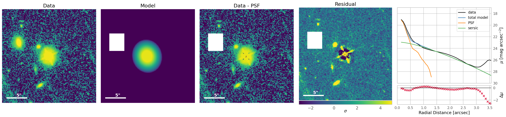

# Summary

Nearly all galaxies contain supermassive black holes at their centers, and some
of these black holes accrete mass rapidly and emit powerful jets, the brightest
sources in the universe.  These systems are called Active Galactic Nuclei (AGN).
Their extremely bright light overlaps with and obscures the light of their host
galaxy, making studies of such galaxies more difficult without a mechanism to
subtract the AGN light.  This is one of many cases in which one employs image
decomposition to model and separate the components of an astronomical image.  A
few well-established programs have become the best tools for this task, but
remain difficult to automate without external 'wrapper' programs.

# Statement of need

gAlactic Faint Feature extractiOn with GALFITM-bAsed Tools in pythOn (`AFFOGATO`)
is a Python package which acts as a wrapper for the popular image decomposition
tool `GALFITM` [@H{\"a}u{\ss}ler:2022] with a particular eye towards studies of
AGN.  Initially written to wrap `GALFIT` [@Peng2002; @Peng:2010] in @Nolan2025,
`AFFOGATO` has been updated to use the newer `GALFITM` to take advantage of a
number of improvements, including the possibility for future users to incorporate
multi-wavelength fitting.  `GALFIT` and `GALFITM` are intentionally structured to
be automated using external scripts, as effective usage requires modelling begin
with well-motivated initial guesses of model parameters (e.g., Sersic index and
magnitude for a Sersic profile), and these can vary widely across different use
cases. However, some general functions are possible to write in Python, which has
become the dominant language for most tasks in astronomy, especially for
early-career scientists.

`AFFOGATO` uses parameter estimation from the `photutils` package [@Bradley2025] to
facilitate automatic "blind" usage of `GALFITM` without manual determination of
initial guesses, and producing informative and aesthetically-pleasing figures (for
an example, see \autoref[fig:example]). In brief, `AFFOGATO` is able to:

 - Download target image data
 - Determine and download appropriate "stock" PSF model
 - Perform 2D image decomposition
 - Output best-fit parameters
 - Plot science-ready figures

While manual fine-tuning remains necessary in general for high-confidence scientific
results (and is possible using the same wrapper functions), this automation greatly
speeds decomposition of medium to large samples of images. In addition to this
general-use functionality, we include a specific example implementation for the
study of AGN host galaxies with HST, which at its highest level only requires the
user to specify the coordinates of an AGN and the desired filter and the utility
automatically downloads the best archived HST data and an appropriate PSF model,
performs the decomposition, and produces an appropriate figure.  This will enable
extremely rapid analysis in studies interested in the underlying features of AGN
host galaxies.  More generally, `AFFOGATO` acts as a well-documented entry point to
development of one's own `GALFITM` wrapper in Python.

# Figures

# Acknowledgements

This material is based on work supported by the National Science Foundation
Graduate Research Fellowship Program under grant No. DGE 21-46756. Any opinions,
findings, and conclusions or recommendations expressed in this material are those
of the author(s) and do not necessarily reflect the views of the National Science
Foundation. 

# References
